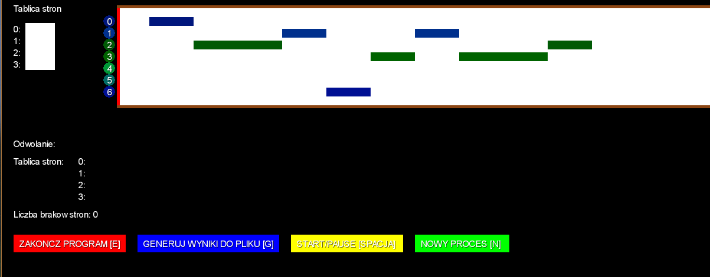

# MemorySimulation

Page replacement algorithms: FIFO, OPT, LRU, second chance

Application developed in Java and libGDX framework.

## Table of contents
* [ProcessSimulation](#processsimulation)
	* [Technologies](#technologies)
	* [Setup](#setup)
	* [Usage](#usage)
	* [Structure of source code](#structure-of-source-code)
	* [Implementation of page replacement algorithms](#implementation-of-page-replacement-algorithms)
	* [Project report](#project-report)

## Technologies

* Java
* libGDX framework: https://libgdx.com/

## Setup

The project was generated by [Project Setup Tool](https://libgdx.com/dev/project-generation/). Also libGDX projects are [Gradle](http://www.gradle.org/) projects, which makes managing dependencies and building considerably easier.

You can download project's files from this repository. Then run in terminal `./gradlew desktop:run` to compile and start the application.

If you want to use your IDE and configure Gradle, see this instructions: https://libgdx.com/dev/import-and-running/.

To build this project I have used Eclipse with Gradle configuration.

## Usage

When the application is launched, the first question to the user is how large the page table should be.

   

The next question is whether to load the data from the data.txt file or to draw it. If the user wants to load data from a file, they must be in the following format:
>the text file should contain one line. Each integer reference should be separated by one space.

   
   

If, on the other hand, the user wants to draw data, he only has to answer the questions of how many references should be drawn and how large the physical memory should be.

The next step is to choose the CPU allocation planning method, which is one of the following:
* FIFO,
* OPT,
* LRU,
* Second chance.

   

After moving on to the simulation, we can visualize the arrival of further references, what numbers are stored in the page table. In addition, the history of data in its frames is displayed in the form of a table on the screen.

Simulation begin:
   

Simulation after some time:
  
 
At any time, we can generate a report for the current state, we can stop the simulation or add a new reference.

## Structure of source code

There are four classes to in this application:
* Processor,
* MemorySimulation,
* Reference,
* TextListener.

Their implementation is located at: `MemorySimulation/core/src/com/mygdx/game/`.

### `Processor` class

This is the most extensive class in the project. It is responsible for loading the references, selecting the page replacement algorithm, executing the algorithm over time and generating data on the screen and to the file.

All references are stored in the dynamic references array, and the reference numbers currently in the storn array are in the `pagesTable` dynamic array.

### `MemorySimulation` class
This is the main class of the design. At startup, it creates variables using constructors, and then in the `render()` function, which is responsible for generating subsequent frames of the application, it calls functions of the `Processor` class that are responsible for drawing the results on the screen and checking whether the user has selected any option by pressing button on keyboard or mouse on screen, time lapse and process handling.

### `Reference` class
This is the class used to hold single reference data. It allows, among others to check its current position in the timeline, its execution progress and calculate the waiting time.

### `TextListener` class
It is a class created solely for the purpose of generating windows with a question to the user and enabling the reading of text. It was used at times such as reading the number of references that need to be randomly selected, the number of frames in a page table.

## Implementation of page replacement algorithms

### FIFO

Thanks to the for loop on line 2, application checks all references. If the time has come for one and it does not exist in the page table, then a page missing error has occurred. Then application removes the null element from the `pagesTable` (lines 7-9) and add the current reference (line 11) to the end of it.

Application increases the number of missing pages in line 10 - it is stored by the `pageFaultCounter` variable.

The `updateDataFrames()` function collects information about the current state of a page array in order to be able to display it on the screen and generate it to a file.

	1.	private void FIFO() {
	2.			for (int i = 0; i < references.size(); i++) {
	3.				if (references.get(i).currentPosition(timer) == 0 && references.get(i).progress() == 0F
	4.						&& !references.get(i).isDone(timeStep)) {
	5.					dataReferences += Integer.toString(references.get(i).pageId()) + "      ";
	6.					if (!pagesTable.contains(references.get(i).pageId())) {
	7.						if (pagesTable.size() == pagesTableSize) {
	8.							pagesTable.remove(0);
	9.						}
	10.						pageFaultCounter++;
	11.						pagesTable.add(references.get(i).pageId());
	12.					}
	13.					updateDataFrames();
	14.				}
	15.				if (references.get(i).currentPosition(timer) == 0) {
	16.					nowRunning = i;
	17.				}
	18.			}
	19.		}

### OPT

This algorithm, unlike FIFO, does not remove the zero element from the `pagesTable` array and does not add a new reference to it, but finds the one that will not be used the longest and puts a new element there.

This method is implemented on lines 8-28. The `victim` variable is currently the best candidate for being replaced, that is, a place in the `pagesTable` that will not be revoked the longest. How many references this place will be called for is shown by the `whenThis` variable.

Thanks to the for loop on line 11, application checks all the page array frames. Thanks to the while loop in line 11, application checks when there will be a reference to this frame. In line 20 application checks whether the currently examined frame is not better than the previously selected candidate. Line 24 checks whether there will be any references to this frame at all.

	1.		private void OPT() {
	2.			for (int i = 0; i < references.size(); i++) {
	3.				if (references.get(i).currentPosition(timer) == 0 && references.get(i).progress() == 0F
	4.						&& !references.get(i).isDone(timeStep)) {
	5.					dataReferences += Integer.toString(references.get(i).pageId()) + "      ";
	6.					if (!pagesTable.contains(references.get(i).pageId())) {
	7.						if (pagesTable.size() == pagesTableSize) {
	8.							// find victim - index in pagesTable for new Reference
	9.							int victim = 0;
	10.							int whenLast = 0;
	11.							for (int j = 0; j < pagesTable.size(); j++) {
	12.								int whenThis = i + 1;
	13.								while (whenThis < references.size()) {
	14.									if (references.get(whenThis).pageId() != pagesTable.get(j)) {
	15.										whenThis++;
	16.									} else {
	17.										break;
	18.									}
	19.								}
	20.								if (whenThis > whenLast) {
	21.									whenLast = whenThis;
	22.									victim = j;
	23.								}
	24.								if (whenThis == references.size()) { // won't be
	25.																		// references at all
	26.									break;
	27.								}
	28.							}
	29.							pagesTable.remove(victim);
	30.							pagesTable.add(victim, references.get(i).pageId());
	31.						} else {
	32.							pagesTable.add(references.get(i).pageId());
	33.						}
	34.						pageFaultCounter++;
	35.					}
	36.					updateDataFrames();
	37.				}
	38.				if (references.get(i).currentPosition(timer) == 0) {
	39.					nowRunning = i;
	40.				}
	41.			}
	42.		}

### LRU

This algorithm differs from the OPT algorithm in only a few places. Instead of checking which frame will be referenced at the latest in the future, it is checked which frame has been referenced most recently. So, instead of examining future references, application checks the ones that have already occurred - you can see this in lines 13-27, where application doesn't increments `whenThis`, but decrement it looking for the smallest value.

	1.		private void LRU() {
	2.			for (int i = 0; i < references.size(); i++) {
	3.				if (references.get(i).currentPosition(timer) == 0 && references.get(i).progress() == 0F
	4.						&& !references.get(i).isDone(timeStep)) {
	5.					dataReferences += Integer.toString(references.get(i).pageId()) + "      ";
	6.					if (!pagesTable.contains(references.get(i).pageId())) {
	7.						if (pagesTable.size() == pagesTableSize) {
	8.							// find victim - index in pagesTable for new Reference
	9.							int victim = 0;
	10.							int whenLast = i;
	11.							for (int j = 0; j < pagesTable.size(); j++) {
	12.								int whenThis = i - 1;
	13.								while (whenThis >= 0) {
	14.									if (references.get(whenThis).pageId() != pagesTable.get(j)) {
	15.										whenThis--;
	16.									} else {
	17.										break;
	18.									}
	19.								}
	20.								if (whenThis < whenLast) {
	21.									whenLast = whenThis;
	22.									victim = j;
	23.								}
	24.								if (whenThis == -1) { // wasn't references at all
	25.														// before
	26.									break;
	27.								}
	28.							}
	29.							pagesTable.remove(victim);
	30.							pagesTable.add(victim, references.get(i).pageId());
	31.						} else {
	32.							pagesTable.add(references.get(i).pageId());
	33.						}
	34.						pageFaultCounter++;
	35.					}
	36.					updateDataFrames();
	37.				}
	38.				if (references.get(i).currentPosition(timer) == 0) {
	39.					nowRunning = i;
	40.				}
	41.			}
	42.		}

### Second chance

This method uses a dynamic array of boolean `referenceBits` that hold 0 or 1 for each frame of the page replacement array. The best frame for a new page in the event of a page missing error is selected on lines 8-21. Successive frames are checked in FIFO order cyclically until the best candidate is found (thanks to the for and while loops on lines 10 and 11). If a given frame is just being called, it is assigned a logical value of 1 (line 27), otherwise 0 (line 13). The new element is inserted into the first frame that has the logical value 0 (lines 20-21).

	1.		private void SecondChance() {
	2.			for (int i = 0; i < references.size(); i++) {
	3.				if (references.get(i).currentPosition(timer) == 0 && references.get(i).progress()== 0F
	4.						&& !references.get(i).isDone(timeStep)) {
	5.					dataReferences += Integer.toString(references.get(i).pageId()) + "       ";
	6.					if (!pagesTable.contains(references.get(i).pageId())) {
	7.						if (pagesTable.size() == pagesTableSize) {
	8.							// find victim - index in pagesTable for new Reference
	9.							int victim = -1;
	10.							while (victim == -1) {
	11.								for (int j = 0; j < pagesTable.size(); j++) {
	12.									if (referenceBits.get(j)) {
	13.										referenceBits.set(j, false);
	14.									} else {
	15.										victim = j;
	16.										break;
	17.									}
	18.								}
	19.							}
	20.							pagesTable.remove(victim);
	21.							referenceBits.remove(victim);
	22.						}
	23.						pagesTable.add(references.get(i).pageId());
	24.						referenceBits.add(true);
	25.						pageFaultCounter++;
	26.					}
	27.					referenceBits.set(pagesTable.indexOf(references.get(i).pageId()), true);
	28.					updateDataFrames();
	29.				}
	30.				if (references.get(i).currentPosition(timer) == 0) {
	31.					nowRunning = i;
	32.				}
	33.			}
	34.		}

## Project report

I completed the laboratory task by writing an application called simulation1.exe in the `executable` folder. The project's source files are located in the `data_files` folder, and the data on which I tested the algorithms used are files in this folder named:
* data_1.txt,
* data_2.txt,
* data_3.txt,
* data_4.txt.
Reports generated for this data are stored in the following files:
* result_1.txt,
* result_2.txt,
* result_3.txt,
* resutl_4.txt.

Only information about the number of missing pages obtained by a given algorithm will be presented below. To see the details of their operation (frame references and requests), open the results files.

### FIFO

For the input data (`data_1.txt` file) results (`result_1.txt`):

Number of missing pages: 14.

### OPT

For the input data (`data_2.txt` file) results (`result_2.txt`):

Number of missing pages: 10.

### LRU

For the input data (`data_3.txt` file) results (`result_3.txt`):

Number of missing pages: 15.

### Second chance

For the input data (`data_4.txt` file) results (`result_4.txt`):

Number of missing pages: 14.

### Summary

Based on the tests performed, I can conclude that the program correctly performs the CPU time allocation planning simulation for the FIFO, OPT, LRU and Second Chance algorithms.

It is very important to compare the missing page counts obtained for each method. We can clearly see that the best result, very out of line with the others, was achieved by the OPT algorithm.

In my opinion, the implementation of these algorithms has been well illustrated also in the graphic part, because thanks to it we can check the status of the page table for each reference on an ongoing basis.

The program has the necessary functions to implement the given simulations. A possible path for its development is, among others the possibility of creating a larger database of performed tests, for example to compare the number of missing pages for a larger number of tests.
